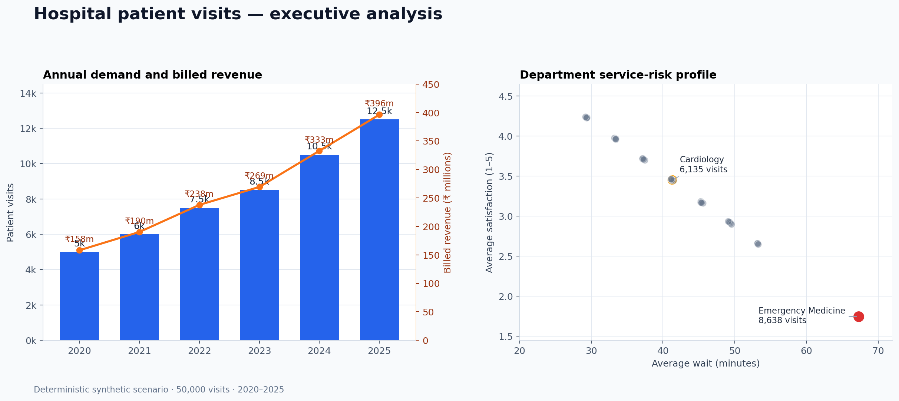
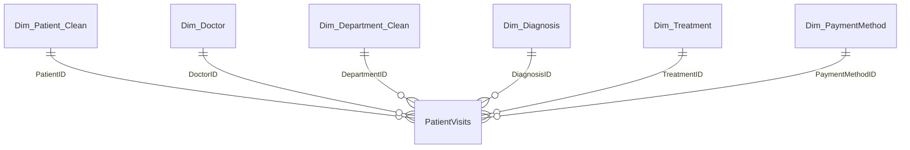

# Hospital Patient Visits Analytics

A Microsoft SQL Server project that converts raw hospital visit data into a
validated star schema and analyzes demand, billed revenue, wait times, patient
satisfaction, and treatment activity.

The visit facts are deterministic synthetic data generated in T-SQL. The
project contains 50,000 visits from 2020 through 2025 and is intended only for
data-engineering and analytics demonstration.

## Results

- Annual visits increased from **5,000 in 2020** to **12,500 in 2025**.
- Emergency Medicine handled **8,638 visits** and **22.34% of billed revenue**.
- Emergency Medicine also had the longest average wait at **67.27 minutes**.
- Cardiology recorded **6,135 visits** and **₹141.02 million** in billed revenue.
- Weekdays accounted for **35,717 visits (71.43%)**.
- The repeat-patient rate was **80.01%**.

Detailed calculations and interpretations are available in
[results/key_findings.md](results/key_findings.md).



## Data model

Four year-partitioned source tables are cleaned and consolidated into the
`PatientVisits` fact table. The final model contains six dimensions.



The source-schema diagram is available in
[diagrams/database_diagram.png](diagrams/database_diagram.png).

## Pipeline

```text
Raw dimensions and yearly visit tables
                    │
                    ▼
      Cleaning and standardization
                    │
                    ▼
      Validated dimensions and fact table
                    │
                    ├── Data-quality checks
                    ├── Analytical indexes
                    └── Business analysis
```

The pipeline:

- standardizes patient names and gender values;
- separates City, State, and Country;
- removes incomplete patient and department records;
- combines yearly visit tables with `UNION ALL`;
- deduplicates visits with `ROW_NUMBER()`;
- enforces referential, date, monetary, satisfaction, and wait-time rules;
- creates indexes for common analytical queries; and
- runs 10 fail-fast data-quality checks.

## Analysis

[analysis/07_business_analysis.sql](analysis/07_business_analysis.sql) contains
12 queries covering:

- operating KPIs and annual growth;
- doctor and department performance;
- payment-method revenue mix;
- age-band analysis;
- wait-time and satisfaction risk;
- weekday and weekend demand;
- monthly trends and cumulative volume;
- repeat-patient activity; and
- treatment frequency by diagnosis.

The queries use CTEs, conditional aggregation, `LAG`, `DENSE_RANK`, running
totals, and accurate age-at-visit calculations.

## Run with Docker

### Requirements

- Docker Desktop
- An `amd64`-compatible SQL Server 2022 container

From the repository root, set a local development password:

```bash
export HOSPITAL_SQL_PASSWORD='REPLACE_WITH_A_STRONG_PASSWORD'
```

Start SQL Server:

```bash
docker run \
  --platform linux/amd64 \
  --name hospital-sql \
  -e ACCEPT_EULA=Y \
  -e MSSQL_SA_PASSWORD="$HOSPITAL_SQL_PASSWORD" \
  -p 1433:1433 \
  -v "$PWD":/project \
  -d \
  mcr.microsoft.com/mssql/server:2022-latest
```

Create the database after SQL Server finishes starting:

```bash
docker exec hospital-sql \
  /opt/mssql-tools18/bin/sqlcmd \
  -S localhost -U sa -P "$HOSPITAL_SQL_PASSWORD" -C \
  -Q "IF DB_ID('HospitalPatientAnalytics') IS NULL CREATE DATABASE HospitalPatientAnalytics;"
```

Run the complete pipeline:

```bash
docker exec -w /project hospital-sql \
  /opt/mssql-tools18/bin/sqlcmd \
  -S localhost -U sa -P "$HOSPITAL_SQL_PASSWORD" -C \
  -d HospitalPatientAnalytics -b -i run_all.sql
```

A successful build prints:

```text
Consolidated visits    50000
All data-quality checks passed.
```

The build was verified on SQL Server 2022 Developer Edition in Docker. It is
rerunnable; `schema/01_create_tables.sql` removes and recreates this project's
tables.

If the container already exists, start it with:

```bash
docker start hospital-sql
```

## Repository structure

```text
.
├── run_all.sql
├── schema/
│   ├── 01_create_tables.sql
│   └── 06_create_indexes.sql
├── data/
│   ├── 02_insert_patients_doctors.sql
│   ├── 03_insert_reference_dimensions.sql
│   └── 04_generate_visits.sql
├── cleaning/
│   └── 05_data_cleaning.sql
├── analysis/
│   └── 07_business_analysis.sql
├── validation/
│   └── 08_data_quality_checks.sql
├── results/
│   ├── key_findings.md
│   └── executive_summary.png
├── scripts/
│   └── generate_executive_summary.py
└── diagrams/
    └── database_diagram.png
```

The chart can be regenerated with:

```bash
python3 -m pip install -r requirements.txt
python3 scripts/generate_executive_summary.py
```

## Limitations

- Results describe a deliberately patterned synthetic dataset, not a real
  hospital.
- The pipeline is batch-oriented and does not model real-time ingestion.
- Billed revenue is expressed in INR and does not represent collected or
  recognized accounting revenue.
